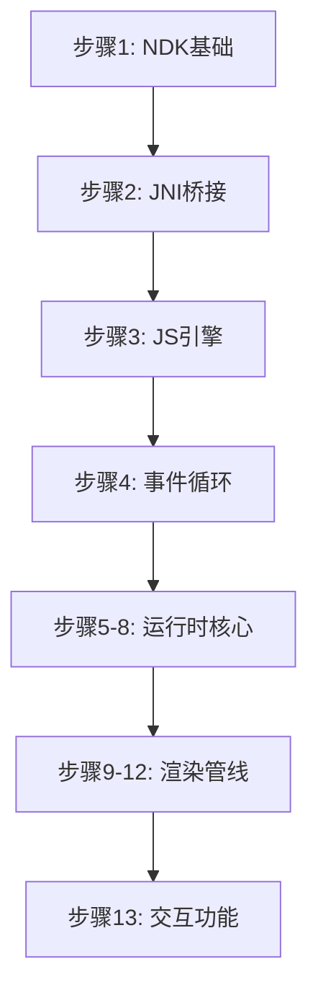

# QuickApp Runtime Android - 实现步骤规范

## 📖 导航入口

### [🚀 步骤索引与快速导航](./steps/00-step-index.md)

点击上面的链接查看所有实现步骤的详细索引，每个步骤都包含：
- 第一性原理描述
- 核心动作（4个以内）
- 直接跳转到详细步骤文档

---

## 📁 目录结构

```
spec/
├── README.md                    # 本文档
├── steps/                       # 所有实现步骤
│   ├── 00-step-index.md        # 步骤索引（新增）
│   ├── 01-android-ndk-skeleton.md
│   ├── 02-platform-bridge-jni.md
│   ├── 03-jsengine-quickjs.md
│   ├── 04-eventloop-thread.md
│   ├── 05-js-bridge.md
│   ├── 06-rpk-manifest.md
│   ├── 07-js-framework-vm.md
│   ├── 08-page-bundle-load.md
│   ├── 09-vnode-style.md
│   ├── 10-yoga-layout.md
│   ├── 11-view-renderer.md
│   ├── 12-render-pipeline-events.md
│   └── 13-router-prompt-titlebar.md
```

## 🎯 实现目标

本规范详细描述了 quickapp-runtime-android 从零到一的完整实现过程，包含 13 个关键步骤，覆盖：

1. **基础架构** (步骤 1-4): NDK 项目、JNI 桥接、JS 引擎、事件循环
2. **运行时核心** (步骤 5-8): JS Bridge、包加载、框架 VM、页面启动
3. **渲染管线** (步骤 9-12): VNode 构建、布局计算、Android 渲染、事件处理
4. **交互功能** (步骤 13): 路由导航、提示、标题栏

## 📝 步骤文档格式

每个步骤文档都遵循统一的格式：
- **第一性描述**: 一句话说明步骤的核心价值
- **核心动作**: 4个以内的关键实现点
- **详细步骤**: 分步指导实现过程
- **技术决策**: 架构和设计选择说明
- **验证方法**: 如何确认实现正确

## 🔍 如何选择步骤

- **新手开发者**: 从步骤 1 开始按顺序实现
- **核心开发者**: 重点关注 JNI、JS 引擎、渲染管线等关键技术点
- **问题排查**: 根据功能模块选择对应步骤参考

## 📈 学习路线建议



---

## 📚 相关资源

- [QuickApp 官方文档](https://doc.quickapp.cn/)
- [Android NDK 开发指南](https://developer.android.com/ndk)
- [QuickJS 项目](https://bellard.org/quickjs/)

---

*文档维护: quickapp-runtime-android 项目组*  
*保持更新，确保与代码实现同步*