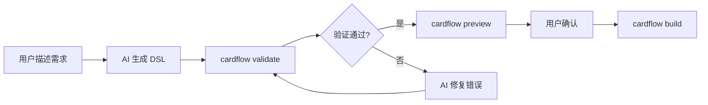

# CardFlow SPEC v0.1

## 目录

- [1. 项目定位](#1-项目定位)
- [2. 架构总览](#2-架构总览)
- [3. Card DSL 协议](#3-card-dsl-协议)
  - [3.1 文件结构](#31-文件结构)
  - [3.2 布局层（Layout）](#32-布局层layout)
  - [3.3 组件类型表](#33-组件类型表)
  - [3.4 数据绑定](#34-数据绑定)
  - [3.5 交互事件](#35-交互事件)
  - [3.6 样式系统](#36-样式系统)
- [4. 渲染端设计](#4-渲染端设计)
  - [4.1 引擎抽象](#41-引擎抽象)
  - [4.2 Flutter 引擎实现](#42-flutter-引擎实现)
  - [4.3 C++ 引擎接口（FFI）](#43-c-引擎接口ffi)
- [5. 编排端设计](#5-编排端设计)
  - [5.1 DAG 编辑器核心](#51-dag-编辑器核心)
  - [5.2 AI Chat 生成 DSL](#52-ai-chat-生成-dsl)
  - [5.3 LLM Prompt 设计](#53-llm-prompt-设计)
- [6. 预览端设计](#6-预览端设计)
  - [6.1 三模式预览](#61-三模式预览)
  - [6.2 BLE 通信协议](#62-ble-通信协议)
- [7. ESP32 渲染端](#7-esp32-渲染端)
  - [7.1 目录结构](#71-目录结构)
  - [7.2 主程序](#72-主程序)
- [8. CLI 设计](#8-cli-设计)
- [9. AI Skills 支持](#9-ai-skills-支持)
- [10. 项目结构（最终）](#10-项目结构最终)
- [11. 评估](#evaluation)

---

## 1. 项目定位

```
CardFlow = 跨端卡片 UI 框架
├─ 核心：一套 DSL 协议，多端渲染
├─ 目标：手机端编排，IoT/眼镜/手表端渲染
├─ 差异化：AI Chat 生成 DSL，实时预览，真机验证
└─ 面试价值：协议设计 + 双端渲染 + 工程化
```

---

## 2. 架构总览

```
┌─────────────────────────────────────────┐
│              CardFlow 架构                 │
├─────────────────────────────────────────┤
│                                         │
│  编排端 (Flutter App)                     │
│  ┌─────────────┐  ┌─────────────┐      │
│  │  DAG Editor  │  │ Card Editor │      │
│  │  流程编排     │  │ 卡片编辑     │      │
│  └──────┬──────┘  └──────┬──────┘      │
│         └────────┬───────┘              │
│                  ▼                      │
│         ┌─────────────┐                 │
│         │  AI Chat    │                 │
│         │  DSL 生成    │                 │
│         └──────┬──────┘                 │
│                │                        │
│         ┌──────┴──────┐                 │
│         ▼           ▼                  │
│    ┌─────────┐  ┌─────────┐            │
│    │ 内嵌预览 │  │ 设备预览 │            │
│    │ Flutter │  │ BLE/WiFi│            │
│    └────┬────┘  └────┬────┘            │
│         └─────────────┘                 │
│                  │                        │
│                  ▼                        │
│         ┌─────────────┐                 │
│         │  Card DSL    │                 │
│         │  v1.0       │                 │
│         └──────┬──────┘                 │
│                │                        │
├────────────────┼────────────────────────┤
│                ▼                        │
│  渲染端                                  │
│  ┌─────────────┐  ┌─────────────────┐  │
│  │ Flutter     │  │ C++ Engine      │  │
│  │ Engine      │  │ (LVGL + Yoga)   │  │
│  │ 手机/预览    │  │ 眼镜/手表/ESP32 │  │
│  └─────────────┘  └─────────────────┘  │
│                                         │
└─────────────────────────────────────────┘
```

---

## 3. Card DSL 协议

### 3.1 文件结构

```json
{
  "$schema": "https://cardflow.dev/schema/card-v1.json",
  "version": "1.0.0",
  "id": "weather_card",
  "meta": {
    "name": "天气卡片",
    "author": "cardflow",
    "createdAt": "2026-07-14T16:40:00Z"
  },
  "layout": { ... },
  "dataBinding": { ... },
  "actions": { ... },
  "styles": { ... }
}
```

### 3.2 布局层（Layout）

```json
{
  "layout": {
    "type": "flex",
    "direction": "column",
    "padding": [16, 16, 16, 16],
    "gap": 8,
    "alignItems": "stretch",
    "justifyContent": "start",
    "children": [
      {
        "type": "text",
        "content": "{{location}}",
        "styleRef": "title"
      },
      {
        "type": "flex",
        "direction": "row",
        "gap": 12,
        "alignItems": "center",
        "children": [
          {
            "type": "image",
            "src": "{{iconUrl}}",
            "style": {"width": 48, "height": 48}
          },
          {
            "type": "text",
            "content": "{{temperature}}°",
            "styleRef": "temp"
          }
        ]
      }
    ]
  }
}
```

### 3.3 组件类型表

| 类型 | 必需属性 | 可选属性 | 说明 |
|------|---------|---------|------|
| `flex` | `direction`, `children` | `gap`, `padding`, `alignItems`, `justifyContent`, `wrap` | 容器 |
| `text` | `content` | `styleRef`, `style`, `maxLines`, `overflow` | 文本 |
| `image` | `src` | `style`, `placeholder`, `error` | 图片 |
| `button` | `label` | `style`, `icon`, `action` | 按钮 |
| `list` | `items`, `itemTemplate` | `gap`, `scrollDirection` | 列表 |
| `divider` | - | `color`, `height`, `margin` | 分割线 |
| `spacer` | - | `flex` | 弹性占位 |

### 3.4 数据绑定

```json
{
  "dataBinding": {
    "location": {
      "source": "api.weather.location",
      "default": "北京"
    },
    "iconUrl": {
      "source": "api.weather.icon",
      "transform": "urlEncode"
    },
    "temperature": {
      "source": "api.weather.temp",
      "transform": "round",
      "unit": "celsius"
    }
  }
}
```

### 3.5 交互事件

```json
{
  "actions": {
    "onTap": {
      "type": "navigate",
      "target": "weather_detail",
      "params": {"location": "{{location}}"}
    },
    "onLongPress": {
      "type": "showMenu",
      "items": [
        {"label": "刷新", "action": {"type": "refresh"}},
        {"label": "设置", "action": {"type": "navigate", "target": "settings"}}
      ]
    }
  }
}
```

### 3.6 样式系统

```json
{
  "styles": {
    "title": {
      "fontSize": 20,
      "color": "#FFFFFF",
      "fontWeight": "bold",
      "fontFamily": "PingFangSC"
    },
    "temp": {
      "fontSize": 40,
      "color": "#FFD700",
      "fontWeight": "medium"
    }
  }
}
```

---

## 4. 渲染端设计

### 4.1 引擎抽象

```dart
// packages/cardflow/lib/src/engine/render_engine.dart

abstract class RenderEngine {
  /// 渲染卡片
  void render(CardDSL card, Map<String, dynamic> data);
  
  /// 更新布局（响应式）
  void updateLayout(LayoutDSL layout);
  
  /// 更新数据（增量刷新）
  void updateData(String key, dynamic value);
  
  /// 处理交互
  void handleAction(String actionId, Map<String, dynamic> params);
  
  /// 释放资源
  void dispose();
  
  /// 引擎类型
  EngineType get type;
}

enum EngineType {
  flutter,    // Flutter Widget 渲染
  native,     // C++ LVGL + Yoga 渲染
}
```

### 4.2 Flutter 引擎实现

```dart
// packages/cardflow/lib/src/engine/flutter_engine.dart

class FlutterRenderEngine implements RenderEngine {
  final _componentMap = <String, WidgetBuilder>{};
  
  FlutterRenderEngine() {
    _registerComponents();
  }
  
  void _registerComponents() {
    _componentMap['flex'] = (props) => FlexComponent(props: props);
    _componentMap['text'] = (props) => TextComponent(props: props);
    _componentMap['image'] = (props) => ImageComponent(props: props);
    _componentMap['button'] = (props) => ButtonComponent(props: props);
    _componentMap['list'] = (props) => ListComponent(props: props);
    _componentMap['divider'] = (props) => DividerComponent(props: props);
    _componentMap['spacer'] = (props) => SpacerComponent(props: props);
  }
  
  @override
  void render(CardDSL card, Map<String, dynamic> data) {
    final resolvedData = _resolveDataBinding(card.dataBinding, data);
    final rootWidget = _buildWidget(card.layout, resolvedData);
    // 通过 Stream/ValueNotifier 通知 UI 更新
  }
  
  Widget _buildWidget(NodeDSL node, Map<String, dynamic> data) {
    final builder = _componentMap[node.type];
    if (builder == null) return const SizedBox();
    
    // 解析样式
    final style = _mergeStyle(node.styleRef, node.style);
    
    // 解析内容（数据绑定替换）
    final content = _resolveContent(node.content, data);
    
    // 递归构建子节点
    final children = node.children?.map((c) => _buildWidget(c, data)).toList();
    
    return builder({
      ...node.props,
      'content': content,
      'style': style,
      'children': children,
    });
  }
  
  @override
  EngineType get type => EngineType.flutter;
  
  // ... 其他方法
}
```

### 4.3 C++ 引擎接口（FFI）

```cpp
// embedded/include/cardflow/render_engine.h

#ifndef CARDFLOW_RENDER_ENGINE_H
#define CARDFLOW_RENDER_ENGINE_H

#include <string>
#include <functional>

namespace cardflow {

struct RenderConfig {
    uint16_t displayWidth;
    uint16_t displayHeight;
    float density;
    bool hasAlpha;
};

struct TouchEvent {
    uint16_t x;
    uint16_t y;
    uint8_t type;  // 0=down, 1=move, 2=up
};

using ActionCallback = std::function<void(const char* actionId, const char* paramsJson)>;

class RenderEngine {
public:
    virtual ~RenderEngine() = default;
    
    // 初始化
    virtual bool init(const RenderConfig& config) = 0;
    
    // 渲染卡片（JSON DSL）
    virtual bool renderCard(const char* dslJson) = 0;
    
    // 更新数据（增量）
    virtual bool updateData(const char* key, const char* value) = 0;
    
    // 处理触摸事件
    virtual bool handleTouch(const TouchEvent& event) = 0;
    
    // 注册动作回调
    virtual void onAction(ActionCallback callback) = 0;
    
    // 释放资源
    virtual void dispose() = 0;
};

// 工厂函数
extern "C" {
    RenderEngine* cardflow_create_engine();
    void cardflow_destroy_engine(RenderEngine* engine);
}

} // namespace cardflow

#endif
```

---

## 5. 编排端设计

### 5.1 DAG 编辑器核心

```dart
// apps/cardflow_editor/lib/dag/dag_editor.dart

class DagEditor extends StatefulWidget {
  final DagGraph initialGraph;
  final ValueChanged<DagGraph> onChanged;
  
  const DagEditor({
    required this.initialGraph,
    required this.onChanged,
  });

  @override
  State<DagEditor> createState() => _DagEditorState();
}

class _DagEditorState extends State<DagEditor> {
  late DagGraph _graph;
  Node? _selectedNode;
  Node? _draggingNode;
  Offset? _dragStart;
  
  // 自动布局算法
  void _autoLayout() {
    final layout = SugiyamaLayout(
      graph: _graph,
      rankSep: 80,
      nodeSep: 40,
    );
    setState(() {
      _graph = layout.compute();
    });
    widget.onChanged(_graph);
  }
  
  // 手势处理
  void _handlePanStart(DragStartDetails details) {
    final hitNode = _hitTest(details.localPosition);
    if (hitNode != null) {
      setState(() => _draggingNode = hitNode);
      _dragStart = hitNode.position;
    }
  }
  
  void _handlePanUpdate(DragUpdateDetails details) {
    if (_draggingNode != null) {
      setState(() {
        _draggingNode!.position += details.delta;
      });
    }
  }
  
  // 渲染
  @override
  Widget build(BuildContext context) {
    return InteractiveViewer(
      boundaryMargin: const EdgeInsets.all(500),
      minScale: 0.2,
      maxScale: 3.0,
      child: GestureDetector(
        onTapUp: (d) => _selectNode(_hitTest(d.localPosition)),
        onPanStart: _handlePanStart,
        onPanUpdate: _handlePanUpdate,
        onPanEnd: (_) => setState(() => _draggingNode = null),
        child: CustomPaint(
          size: const Size(3000, 2000),
          painter: DagPainter(
            graph: _graph,
            selectedNode: _selectedNode,
            draggingNode: _draggingNode,
          ),
        ),
      ),
    );
  }
}
```

### 5.2 AI Chat 生成 DSL

```dart
// apps/cardflow_editor/lib/ai/ai_chat.dart

class AIChatPanel extends StatefulWidget {
  final ValueChanged<CardDSL> onCardGenerated;
  
  const AIChatPanel({required this.onCardGenerated});

  @override
  State<AIChatPanel> createState() => _AIChatPanelState();
}

class _AIChatPanelState extends State<AIChatPanel> {
  final List<ChatMessage> _messages = [];
  final _controller = TextEditingController();
  
  Future<void> _sendMessage(String text) async {
    // 添加用户消息
    setState(() => _messages.add(ChatMessage.user(text)));
    
    // 调用 LLM API
    final response = await LLMService().generateDSL(text, context: _messages);
    
    // 解析响应
    if (response.hasDSL) {
      final card = CardDSL.fromJson(response.dsl);
      
      setState(() {
        _messages.add(ChatMessage.ai(
          text: response.explanation,
          preview: card,
        ));
      });
      
      // 自动预览
      widget.onCardGenerated(card);
    }
  }
  
  @override
  Widget build(BuildContext context) {
    return Column(
      children: [
        Expanded(
          child: ListView.builder(
            itemCount: _messages.length,
            itemBuilder: (context, index) => _buildMessage(_messages[index]),
          ),
        ),
        _buildInput(),
      ],
    );
  }
  
  Widget _buildMessage(ChatMessage msg) {
    return Column(
      crossAxisAlignment: CrossAxisAlignment.start,
      children: [
        Text(msg.text),
        if (msg.preview != null)
          GestureDetector(
            onTap: () => widget.onCardGenerated(msg.preview!),
            child: Container(
              height: 200,
              child: CardPreview(card: msg.preview!),
            ),
          ),
      ],
    );
  }
}
```

### 5.3 LLM Prompt 设计

```dart
// apps/cardflow_editor/lib/ai/prompt.dart

const String dslGenerationPrompt = '''
你是一个 CardFlow DSL 生成专家。根据用户描述，生成符合 CardFlow v1 协议的 JSON。

可用组件类型：
- flex: 容器，支持 direction(row/column), gap, padding, alignItems, justifyContent
- text: 文本，支持 content, style(fontSize, color, fontWeight)
- image: 图片，支持 src, style(width, height)
- button: 按钮，支持 label, action
- list: 列表，支持 items, itemTemplate
- divider: 分割线
- spacer: 弹性占位

样式系统：
- 支持 styleRef 引用预定义样式
- 支持内联 style 覆盖
- 颜色格式：#RRGGBB 或 #AARRGGBB

数据绑定：
- 使用 {{key}} 语法
- 支持 transform: urlEncode, round, dateFormat

交互：
- onTap: navigate, refresh, showMenu, openUrl
- onLongPress: 同 onTap

输出要求：
1. 只输出纯 JSON，不要 markdown 代码块
2. 确保 JSON 合法，可被解析
3. 布局要合理，符合移动端设计规范
4. 颜色对比度要足够

用户描述：{userInput}
''';
```

---

## 6. 预览端设计

### 6.1 三模式预览

```dart
// apps/cardflow_editor/lib/preview/preview_manager.dart

enum PreviewMode {
  embedded,    // 内嵌，同 App Flutter 渲染
  standalone,  // 独立 App，进程隔离
  device,      // 真机设备（ESP32）
}

class PreviewManager {
  final _modeController = StreamController<PreviewMode>.broadcast();
  RenderEngine? _currentEngine;
  
  Stream<PreviewMode> get modeStream => _modeController.stream;
  
  Future<void> preview(CardDSL card, PreviewMode mode) async {
    _modeController.add(mode);
    
    switch (mode) {
      case PreviewMode.embedded:
        _currentEngine = FlutterRenderEngine();
        _currentEngine!.render(card, mockData);
        break;
        
      case PreviewMode.standalone:
        await IPCClient().sendCard(card);
        break;
        
      case PreviewMode.device:
        await BleConnector().sendCard(card);
        break;
    }
  }
}
```

### 6.2 BLE 通信协议

```dart
// packages/cardflow/lib/src/transport/ble_protocol.dart

class BleProtocol {
  static const String SERVICE_UUID = '4fafc201-1fb5-459e-8fcc-c5c9c331914b';
  static const String DSL_CHAR_UUID = 'beb5483e-36e1-4688-b7f5-ea07361b26a8';
  static const String DATA_CHAR_UUID = 'c01c1c2d-5f7a-4f9e-9f8e-1a2b3c4d5e6f';
  static const String CMD_CHAR_UUID = 'd12e2f3e-6f8b-5f0f-0f9f-2b3c4d5e6f7g';
  
  // 发送卡片 DSL（分片，MTU 限制）
  static Future<void> sendCard(CardDSL card) async {
    final json = jsonEncode(card.toJson());
    final chunks = _chunk(json, mtu: 512);
    
    for (final chunk in chunks) {
      await _writeCharacteristic(DSL_CHAR_UUID, chunk);
    }
    
    // 发送结束标记
    await _writeCharacteristic(DSL_CHAR_UUID, [0x00]);
  }
  
  // 发送增量数据更新
  static Future<void> updateData(String key, dynamic value) async {
    final data = jsonEncode({'key': key, 'value': value});
    await _writeCharacteristic(DATA_CHAR_UUID, utf8.encode(data));
  }
  
  // 发送控制命令
  static Future<void> sendCommand(String cmd, [Map? params]) async {
    final data = jsonEncode({'cmd': cmd, 'params': params});
    await _writeCharacteristic(CMD_CHAR_UUID, utf8.encode(data));
  }
  
  static List<List<int>> _chunk(String data, {required int mtu}) {
    final bytes = utf8.encode(data);
    final chunks = <List<int>>[];
    for (var i = 0; i < bytes.length; i += mtu) {
      chunks.add(bytes.sublist(i, (i + mtu).clamp(0, bytes.length)));
    }
    return chunks;
  }
}
```

---

## 7. ESP32 渲染端

### 7.1 目录结构

```
embedded/
├── include/
│   └── cardflow/
│       ├── render_engine.h
│       ├── dsl_parser.h
│       ├── yoga_layout.h
│       └── lvgl_display.h
├── src/
│   ├── main.cpp
│   ├── render_engine.cpp
│   ├── dsl_parser.cpp
│   ├── yoga_layout.cpp
│   └── lvgl_display.cpp
├── lib/
│   ├── lvgl/           # LVGL 库
│   └── yoga/           # Yoga 库
└── platformio.ini      # PlatformIO 配置
```

### 7.2 主程序

```cpp
// embedded/src/main.cpp

#include <Arduino.h>
#include <BLEDevice.h>
#include <BLEServer.h>
#include <BLECharacteristic.h>
#include <cardflow/render_engine.h>

using namespace cardflow;

// BLE 回调
class DSLCallback : public BLECharacteristicCallbacks {
    RenderEngine* engine;
    
public:
    DSLCallback(RenderEngine* e) : engine(e) {}
    
    void onWrite(BLECharacteristic* characteristic) {
        std::string value = characteristic->getValue();
        if (value.empty()) return;
        
        // 检查结束标记
        if (value[0] == 0x00) {
            // 完整 DSL 接收完毕，开始渲染
            engine->renderCard(dslBuffer.c_str());
            dslBuffer.clear();
        } else {
            dslBuffer += value;
        }
    }
    
private:
    std::string dslBuffer;
};

RenderEngine* engine;

void setup() {
    Serial.begin(115200);
    
    // 初始化渲染引擎
    RenderConfig config = {
        .displayWidth = 280,
        .displayHeight = 240,
        .density = 1.0f,
        .hasAlpha = false
    };
    
    engine = cardflow_create_engine();
    engine->init(config);
    
    // 初始化 BLE
    BLEDevice::init("CardFlow-Device");
    BLEServer* server = BLEDevice::createServer();
    BLEService* service = server->createService(BLE_SERVICE_UUID);
    
    BLECharacteristic* dslChar = service->createCharacteristic(
        BLE_DSL_CHAR_UUID,
        BLECharacteristic::PROPERTY_WRITE
    );
    dslChar->setCallbacks(new DSLCallback(engine));
    
    service->start();
    BLEAdvertising* advertising = BLEDevice::getAdvertising();
    advertising->addServiceUUID(BLE_SERVICE_UUID);
    advertising->start();
    
    Serial.println("CardFlow device ready");
}

void loop() {
    // LVGL 任务处理
    lv_timer_handler();
    
    // 触摸处理（如有）
    // ...
    
    delay(5);
}
```

---

## 8. CLI 设计

```dart
// packages/cardflow_cli/bin/cardflow.dart

import 'package:args/command_runner.dart';

void main(List<String> args) {
  final runner = CommandRunner('cardflow', 'CardFlow development toolkit')
    ..addCommand(InitCommand())
    ..addCommand(ValidateCommand())
    ..addCommand(PreviewCommand())
    ..addCommand(BuildCommand())
    ..addCommand(DeviceCommand());

  runner.run(args);
}

// cardflow init my_card --template weather
class InitCommand extends Command {
  @override
  final name = 'init';
  
  @override
  final description = 'Initialize a new card project';

  @override
  void run() {
    final name = argResults!.rest.first;
    final template = argResults?['template'] ?? 'empty';
    
    // 创建目录
    // 复制模板
    // 生成基础 DSL
    
    print('✅ Created $name/');
    print('   Next: cd $name && cardflow validate');
  }
}

// cardflow validate
class ValidateCommand extends Command {
  @override
  void run() {
    final file = argResults?['file'] ?? 'card.json';
    final dsl = File(file).readAsStringSync();
    
    // JSON Schema 验证
    final errors = DSLValidator().validate(dsl);
    
    if (errors.isEmpty) {
      print('✅ DSL validation passed');
    } else {
      print('❌ Validation failed:');
      errors.forEach(print);
    }
  }
}

// cardflow preview --device phone|glasses|esp32
class PreviewCommand extends Command {
  @override
  void run() {
    final device = argResults?['device'] ?? 'phone';
    
    switch (device) {
      case 'phone':
        // 启动 Flutter 预览
        Process.start('flutter', ['run', '-d', 'all']);
        break;
      case 'glasses':
        // 启动独立预览 App
        Process.start('flutter', ['run', '-d', 'preview_app']);
        break;
      case 'esp32':
        // 通过 BLE 发送到设备
        BleTool().sendToDevice('card.json');
        break;
    }
  }
}

// cardflow device scan
class DeviceCommand extends Command {
  @override
  final name = 'device';
  
  @override
  final description = 'Manage connected devices';
  
  DeviceCommand() {
    addSubcommand(ScanCommand());
    addSubcommand(ConnectCommand());
    addSubcommand(LogsCommand());
  }
}
```

---

## 9. AI Skills 支持

```markdown
<!-- packages/cardflow_cli/README.md -->

# CardFlow CLI - AI Agent 使用指南

CardFlow CLI 提供完整的卡片开发工具链，AI Agent 可通过以下命令辅助开发。

## 安装

```bash
dart pub global activate cardflow_cli
```

## 命令列表

### `cardflow init <name> [options]`

初始化卡片项目。

```bash
# AI 调用示例
cardflow init weather_card --template weather --author "AI Agent"
```

### `cardflow validate [options]`

验证 DSL 语法。

```bash
# AI 调用示例
cardflow validate --file weather_card/card.json --strict
```

### `cardflow preview --device <type>`

预览卡片效果。

```bash
# AI 调用示例
cardflow preview --device phone        # 手机预览
cardflow preview --device glasses      # 眼镜模拟预览
cardflow preview --device esp32        # ESP32 真机预览
```

### `cardflow build --target <type>`

构建发布包。

```bash
# AI 调用示例
cardflow build --target all            # 所有平台
cardflow build --target flutter        # Flutter 包
cardflow build --target embedded       # C++ 嵌入式包
```

### `cardflow device <subcommand>`

管理连接设备。

```bash
cardflow device scan                   # 扫描 BLE 设备
cardflow device connect --id <mac>     # 连接设备
cardflow device logs                   # 查看设备日志
```

## AI Agent 工作流



## 示例：AI 辅助开发天气卡片

1. 用户："帮我做一个天气卡片"
2. AI 生成 DSL → 保存到 `weather_card/card.json`
3. AI 执行：`cardflow validate --file weather_card/card.json`
4. AI 执行：`cardflow preview --device phone`
5. 用户查看预览，提出修改
6. AI 修改 DSL，重复 3-5
7. 用户确认后：`cardflow build --target all`
```

---

## 10. 项目结构（最终）

cardflow/
├── README.md
├── docs/
│   ├── architecture.md
│   ├── dsl-spec.md
│   └── ai-integration.md
├── packages/
│   ├── cardflow_protocol/
│   │   ├── lib/
│   │   │   ├── src/
│   │   │   │   ├── dsl/
│   │   │   │   │   ├── card.dart
│   │   │   │   │   ├── layout.dart
│   │   │   │   │   ├── style.dart
│   │   │   │   │   └── action.dart
│   │   │   │   ├── parser.dart
│   │   │   │   ├── validator.dart
│   │   │   │   └── serializer.dart
│   │   │   └── cardflow_protocol.dart
│   │   └── pubspec.yaml
│   │
│   ├── cardflow/
│   │   ├── lib/
│   │   │   ├── src/
│   │   │   │   ├── engine/
│   │   │   │   │   ├── render_engine.dart
│   │   │   │   │   ├── flutter_engine.dart
│   │   │   │   │   └── ffi_bridge.dart
│   │   │   │   ├── components/
│   │   │   │   │   ├── flex.dart
│   │   │   │   │   ├── text.dart
│   │   │   │   │   ├── image.dart
│   │   │   │   │   └── button.dart
│   │   │   │   └── cardflow.dart
│   │   │   └── cardflow.dart
│   │   └── pubspec.yaml
│   │
│   ├── cardflow_ipc/
│   │   ├── lib/
│   │   │   ├── src/
│   │   │   │   ├── ipc_client.dart
│   │   │   │   ├── ipc_server.dart
│   │   │   │   └── protocol.dart
│   │   │   └── cardflow_ipc.dart
│   │   └── pubspec.yaml
│   │
│   └── cardflow_cli/
│       ├── bin/
│       │   └── cardflow.dart
│       ├── lib/
│       │   ├── commands/
│       │   │   ├── init.dart
│       │   │   ├── validate.dart
│       │   │   ├── preview.dart
│       │   │   ├── build.dart
│       │   │   └── device.dart
│       │   └── templates/
│       │       ├── empty/
│       │       ├── weather/
│       │       └── timer/
│       ├── README.md
│       └── pubspec.yaml
│
├── apps/
│   ├── cardflow_editor/
│   │   ├── lib/
│   │   │   ├── main.dart
│   │   │   ├── screens/
│   │   │   │   ├── editor_screen.dart
│   │   │   │   ├── preview_screen.dart
│   │   │   │   └── ai_chat_screen.dart
│   │   │   ├── dag/
│   │   │   ├── ai/
│   │   │   └── services/
│   │   └── pubspec.yaml
│   │
│   └── cardflow_preview/
│       ├── lib/
│       │   ├── main.dart
│       │   └── screens/
│       └── pubspec.yaml
│
└── embedded/
    ├── include/
    ├── src/
    ├── lib/
    └── platformio.ini
```


---

<a id="evaluation"></a>

## 11. 评估

### 当前优势

- DSL 协议设计完整，组件类型、数据绑定、样式、交互四层分离清晰
- 架构图数据流清楚：编排端 → DSL → 渲染端
- 渲染引擎抽象合理（`RenderEngine` 接口 + Flutter/C++ 双实现）
- BLE 通信协议考虑了 MTU 分片，贴近真实场景
- CLI 命令设计实用，AI Agent 工作流完整
- 最终项目结构（monorepo）划分干净

### 待补充项

| # | 问题 | 说明 | 优先级 |
|---|------|------|--------|
| 1 | 协议版本演进策略 | DSL 未来升级时旧版怎么兼容？需要 versioning / migration 方案 | P1 |
| 2 | 错误处理 | DSL 解析失败、BLE 断连、渲染异常的 fallback 策略 | P0 |
| 3 | 性能约束量化 | ESP32 内存有限（~512KB SRAM），DSL 最大体积？LVGL 帧率目标？ | P1 |
| 4 | 数据来源定义 | `dataBinding.source` 的数据从哪来？编排端推送 vs 设备端拉取？ | P1 |
| 5 | 递归渲染风险 | `_buildWidget` 深层嵌套可能栈溢出，考虑改为迭代式构建 | P2 |
| 6 | AI Prompt 上下文 | 当前 prompt 是静态的，需要包含已有 DSL 上下文才能支持增量修改 | P1 |
| 7 | 测试策略 | DSL 验证单元测试、渲染 golden test、BLE mock 测试均未提及 | P0 |

### 下一步建议

1. **先补错误处理和测试策略**（P0），这是实际开发中最先碰到的问题
2. **量化性能约束**，定义 DSL 最大体积、组件最大嵌套层数、渲染帧率目标
3. **定义协议版本号规则**，预留向后兼容机制
4. **AI Prompt 改为动态模板**，注入当前 DSL 上下文
5. 考虑补一份 **错误码表**（DSL 校验错误、BLE 通信错误、渲染错误分类）
